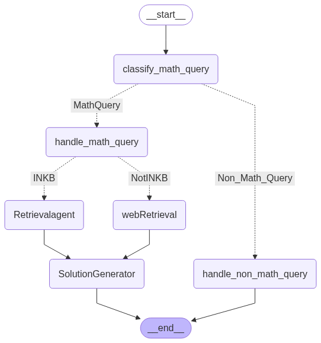
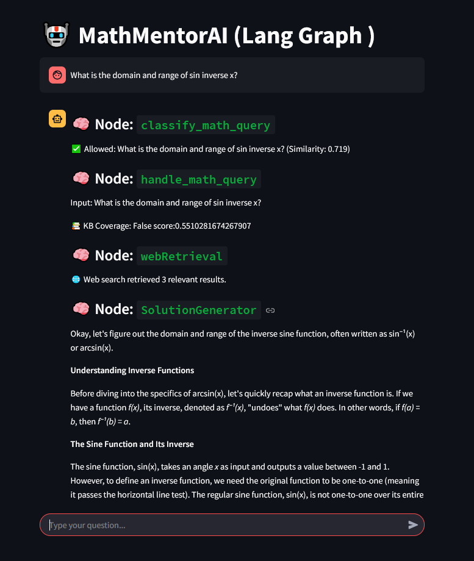

# MathMentorAI: Agentic RAG Math Tutor

**MathMentorAI** is an agentic, retrieval-augmented chatbot designed to behave like a math professor. Built using [LangGraph](https://github.com/langchain-ai/langgraph), FAISS, and Gemini Pro (via Google Generative AI), it intelligently classifies, retrieves, explains, and refines mathematical queries — complete with web search fallback and human-in-the-loop feedback.

---

## 🚀 Features

* 🔎 **Math Query Classification** (LLM + Embedding-based)
* 📚 **In-Knowledge-Base Retrieval** using FAISS
* 🌐 **Web Search Fallback** via SerpAPI
* 🧠 **Step-by-Step Math Solution Generation**
* 🧼 **Chunk Cleaning Agent** for OCR & structure correction
* 🗣️ **Human-in-the-Loop Feedback Capture** (Upvote/Downvote)
* 🧩 **DSPy-powered RAG Pipeline** for answer synthesis
* 🎛️ **Streamlit UI** for interaction and feedback

---

## 🧱 Architecture

### Powered by LangGraph's agent framework with DSPy-enhanced RAG:

---

## **🧰 Technologies Used**

* **🧠 LangGraph:** Multi-agent workflow
* **🔄 DSPy:** Modular LLM programs for RAG and response generation
* **🌐 LangChain:** For embeddings and retrieval logic
* **🔎 FAISS:** Semantic vector store for fast retrieval
* **🤖 Gemini:** Google Generative AI (Gemini 2.0 Flash)
* **📄 PyMuPDF:** Robust PDF parsing
* **🔍 SerpAPI:** Real-time web search
* **🧼 Cleaning Agent:** OCR and structure correction for PDFs
* **🗣️ Human-in-the-Loop Feedback:** Vote-based quality control
* **🌐 Streamlit:** Chat interface and feedback collection

---

## **📘 Knowledge Base**

The knowledge base is built using math textbooks from CBSE Classes 10, 11, and 12, covering:

* Algebra
* Geometry
* Trigonometry
* Calculus
* Probability
* Coordinate Geometry
* and more...

The textbooks were processed using:

* ✅ Custom PDF cleaning
* ✅ Text chunking with overlap for mathematical continuity
* ✅ Embedding and indexing using SentenceTransformers + FAISS

## **💬 How it Works**

1.  User enters a query via the Streamlit chat interface.
2.  Query is passed to LangGraph for node-based processing.
3.  `classify_math_query`: Determines if the input is a math query.
4.  `handle_math_query`: Checks if the KB has relevant content.
5.  Depending on coverage:
    * KB → `Retrievalagent` → `SolutionGenerator`
    * No KB → `webRetrieval` → `SolutionGenerator`
6.  `FeedbackCollector`: Allows user to submit human feedback.

## 📸 UI Preview

## 📊 Benchmark Results (JEE Physics/Math MCQ)

The system was evaluated on a small set of **5 JEE-style multiple-choice questions** from a custom dataset:

| Metric                    | Value      |
|--------------------------|------------|
| Dataset File             | `dataset.json` |
| Total Problems           | 5          |
| Successful Runs          | 5 (100%)   |
| Correct Answers          | 1          |
| **Overall Accuracy**     | **20%**    |
| Success Rate             | 100%       |
| Error Rate               | 0%         |

### 📌 Question Type Breakdown

| Type             | Count | Correct | Accuracy |
|------------------|-------|---------|----------|
| MCQ (Single)     | 2     | 1       | 50%      |
| MCQ (Multiple)   | 3     | 0       | 0%       |

> ⚠️ **Note:** Due to API limitations (SerpAPI quota exhaustion), only **5 questions** were processed during this run. A larger benchmark will be conducted once the quota resets to get a more representative evaluation.

## ✅ Conclusion

**MathMentorAI** is a hybrid agentic-RAG system that intelligently handles math-focused student queries by leveraging:

- Semantic classification (to detect math vs. non-math intent)
- Vector-based knowledge retrieval from CBSE class 10–12 math textbooks
- Web fallback (via SerpAPI) when no relevant material is found in the internal knowledge base
- Step-by-step solution generation using a Gemini-powered tutor agent
- Human-in-the-loop feedback logging for continuous improvement

Despite a limited benchmark run (due to API rate limits), the system demonstrated strong architectural reliability, completing all queries successfully. With future improvements in knowledge coverage, web parsing, and multi-agent coordination, **MathMentorAI** can evolve into a production-ready educational assistant capable of supporting math learners at scale.

---

> 🔧 Next steps include improving retrieval coverage, expanding the dataset size for benchmarking, and integrating DSPy for feedback-based agent refinement.

