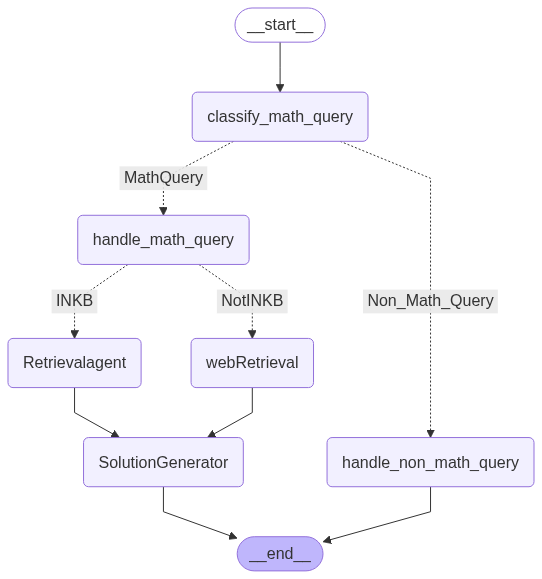

# MathMentorAI: Agentic RAG Math Tutor

**MathMentorAI** is an agentic, retrieval-augmented chatbot designed to behave like a math professor. Built using [LangGraph](https://github.com/langchain-ai/langgraph), FAISS, and Gemini Pro (via Google Generative AI), it intelligently classifies, retrieves, explains, and refines mathematical queries — complete with web search fallback and human-in-the-loop feedback.

---

## 🚀 Features

- 🔎 **Math Query Classification** (LLM + Embedding-based)
- 📚 **In-Knowledge-Base Retrieval** using FAISS
- 🌐 **Web Search Fallback** via SerpAPI
- 🧠 **Step-by-Step Math Solution Generation**
- 🧹 **Chunk Cleaning Agent** for OCR & structure correction
- 🗣️ **Human-in-the-Loop Feedback Capture**
- 🎛️ Streamlit UI for chatting and feedback

---

## 🧱 Architecture

### Powered by LangGraph's agent framework:

## **🧰 Technologies Used**

* **🧠 LangGraph:** Multi-agent workflow
* **🌐 LangChain**
* **🔎 FAISS:** Semantic retrieval
* **🤖 Gemini:** Google Generative AI
* **📄 PyMuPDF:** For better PDF parsing
* **🔍 SerpAPI:** Live Google search results
* **🧼 Custom cleaning agent:** For OCR/noise removal
* **🌐 Streamlit:** For the web frontend

## 📸 UI Preview

